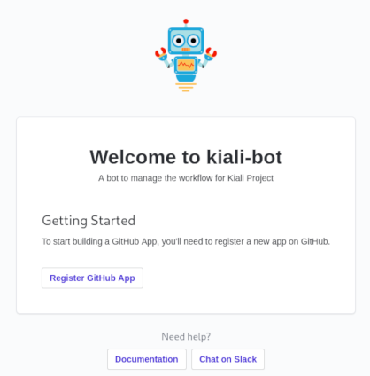
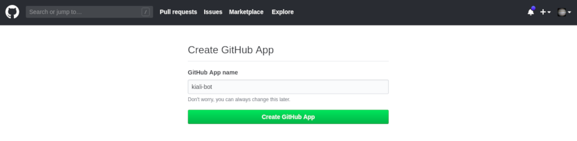
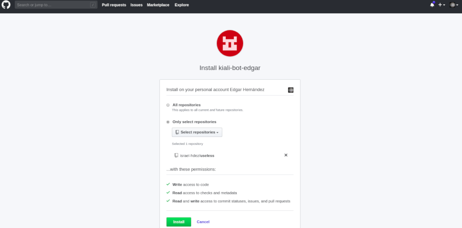

# Contributing

[fork]: /fork
[code-of-conduct]: https://github.com/kiali/kiali/blob/master/CODE_OF_CONDUCT.md

As with any project, there is some boring and repetitive work. We welcome
contributions to automate this work :smile:

Contributions to the code are received as pull requests.
For other kind of contributions, please open an [issue in the kiali
back-end repository](https://github.com/kiali/kiali/issues).

Please note that _kiali-bot_ is released with a [Contributor Code
of Conduct][code-of-conduct]. By participating in this project you agree to
abide by its terms. Also, make sure that you are comfortable with
the [LICENSE](LICENSE).

The rest of this file is dedicated to describe how to setup a
development environment.

* [Developer pre-requisites](#developer-pre-requisites)
* [Developer setup](#developer-setup)
  + [Create a test repository](#create-a-test-repository)
  + [Create a `.env` file.](#create-a--env--file)
  + [Build and run the code](#build-and-run-the-code)
  + [Setup the GitHub App under your account](#setup-the-github-app-under-your-account)
  + TODO: [Setup Mailjet (optional)](#setup-mailjet--optional-)
* [Testing and code linting](#testing-and-code-linting)
* [Updating the manifest file](#updating-the-manifest-file)
* [Deploying kiali-bot](#deploying-kiali-bot)


## Developer pre-requisites

* Please, familiarize yourself with the Probot framework: https://probot.github.io/docs/
* You will need NodeJs. Recommended version is 10.x (current LTS).

## Developer setup

To have a working development environment you need to:

* Create a test repository.
* [Fork][fork] and clone the _kiali-bot_ repository.
* Create a `.env` file.
* Build and run the code.
* Setup the GitHub App under your account.
* Setup Mailjet (optional).

Some of these steps are detailed in the following sections.

### Create a test repository

Since _kiali-bot_ reacts to events happening at GitHub repositories,
you will need to create a test repository.

Please, go to https://github.com/new and create a repository under
your GitHub account.

### Create a `.env` file.

After you clone the repository on your machine, you will need to
create a `.env` file with reasonable options for your local
development environment.

You can use the provided `.env.example` file:

```sh
cp .env.example .env
```

Then, change the following variables:

```
# kiali-bot account
KIALI_BOT_USER=your_github_handle

# Repository names
BACKEND_REPO_NAME=your_test_repo
FRONTEND_REPO_NAME=your_test_repo
```

This is enough for starting up.

### Build and run the code

After you create a `.env` file (make sure your changes are properly
saved), proceed to install dependencies:

```sh
npm i
```

Then, transpile the typescript code and run the bot:

```sh
npm run dev
```

The first time you run this command, it will update your `.env` file
to populate the `WEBHOOK_PROXY_URL` variable. This will let GitHub to
communicate with your locally running instance of _kiali-bot_. You
should see an output like the following that will indicate it's
properly running:

```
17:52:32.996Z  INFO probot: Listening on http://localhost:3000
17:52:35.293Z  INFO probot:
  
  Welcome to Probot! Go to http://localhost:3000 to get started.
```

### Setup the GitHub App under your account

Once you have the app running on your machine, you'll need to setup
a GitHub App to start receiving web hooks.

Access http://localhost:3000 in your browser. You should see a page
that looks like this image:



Push the _Register GitHub App_ button. You will be redirected to GitHub
and you may need to confirm your GitHub password. Then, you should see
a form like this one:



The _kiali-bot_ name is already in use. So, use a different for your 
development instance. Push the _Create GitHub App_ button. If creation
succeeds, you will see the install page and your `.env` will be file populated
with `APP_ID`, `WEBHOOK_SECRET` and `PRIVATE_KEY` variables. Although
this is just a test/dev app, it's probably a good idea to keep these values
as secrets. This is the last change that the `.env` file will suffer.
Try to not loose this file or you will need to setup the app again.

In the install page, choose _Only select repositories_ and select the
test repository that you should have created previously:



Push the _Install_ button. This finishes the setup of the app.

Now, go to the terminal where the app is running and restart it:
press Ctrl+C to stop the app, then run `npm run dev` again.

You are all set! Your local instance should now start receiving
web hooks from GitHub. Happy coding!

### Setup Mailjet (optional)

TODO

## Testing and code linting

Read the [relevant Probot documentation](https://probot.github.io/docs/testing/)
to learn little about testing.

All tests should be placed under the `test/` directory. If you need
any JSON or data fixture, place these files under the `test/fixtures/`
directory. 

This project uses [Jest](https://jestjs.io/) as test runner, and
[ESlint](https://eslint.org/) with [Prettier](https://prettier.io/)
for code linting. To run both the tests and analyze the code with the
linter, invoke:

```sh
npm test
```

If the linter detects issues, it may report that some issues can be
fixed automatically. To fix these issues, run

```sh
npm lint
```

## Updating the manifest file

The manifest the [app.yml](app.yml) file. It contains the set of
privileges that are required for the app to run correctly. It is
used to have an easier developer setup. Without it, you would need
to manually choose the privileges for the app during developer
setup.

If you open a pull request and your changes involve a change to the
set of privileges, please update the manifest with the new set
to keep a straightforward developer setup. Also, clearly mention
this in your PR. If your changes require a broader set of permissions,
you will need to ask somebody with admin privileges in the Kiali
organization to change the bot config with the new privileges
**before** your PR is merged. If some privileges can be dropped,
you can merge your PR and, thereafter, ask for the change of
privileges.

## Deploying kiali-bot

The _kiali-bot_ is under continuous delivery. All changes
to the master branch are deployed automatically.

When you merge a pull request, please make sure that the bot
reacted properly to any activity that may have occurred, because
there is a very small downtime while deployment is happening.

If your pull request does not involve code changes, make sure
to [skip the build](https://docs.travis-ci.com/user/customizing-the-build#skipping-a-build)
to avoid the downtime.
